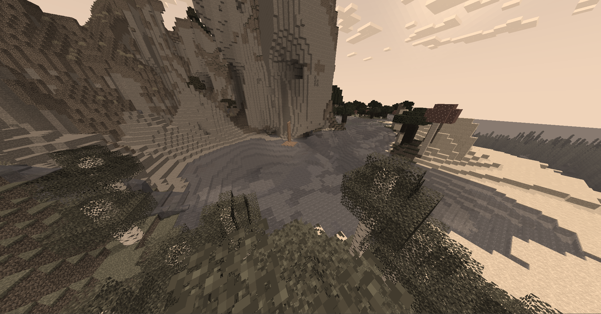
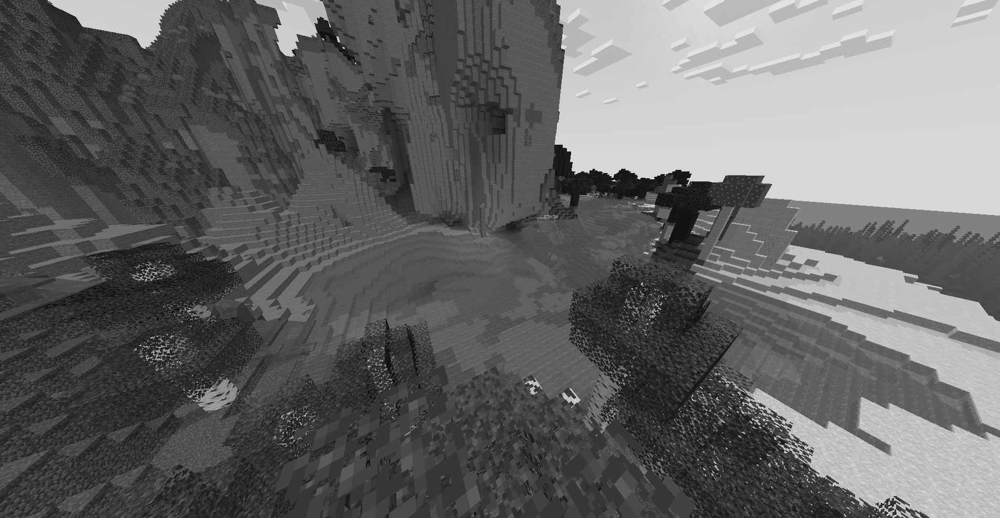
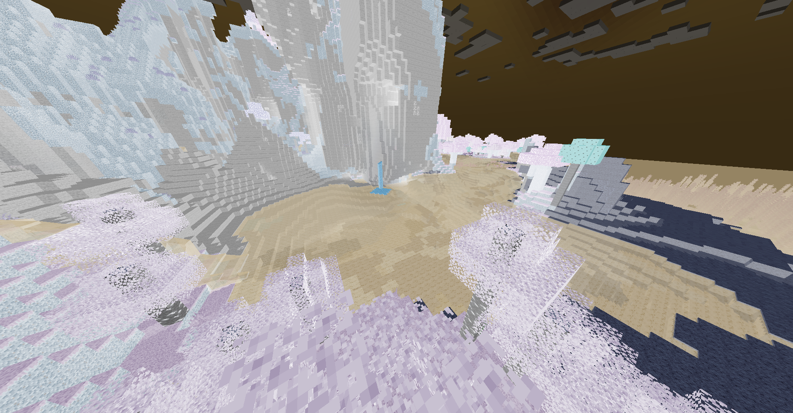
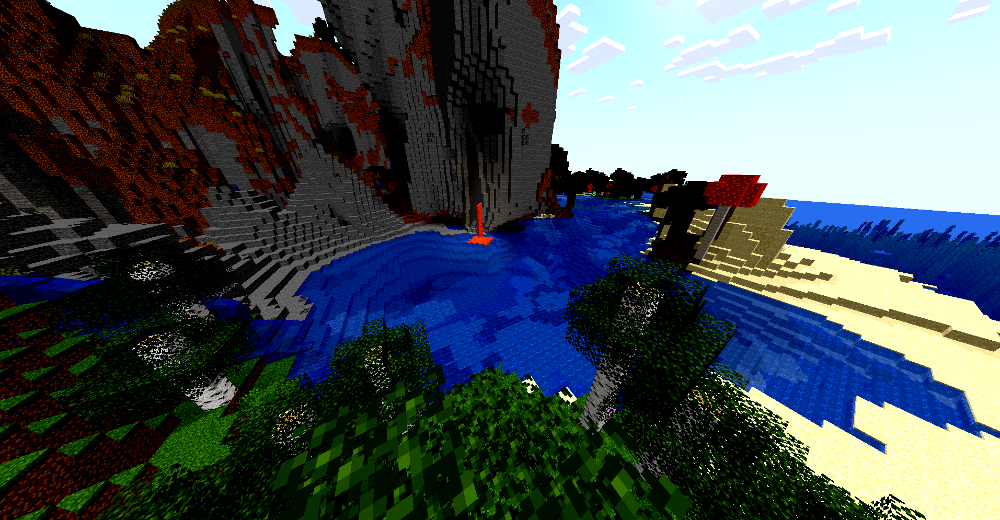
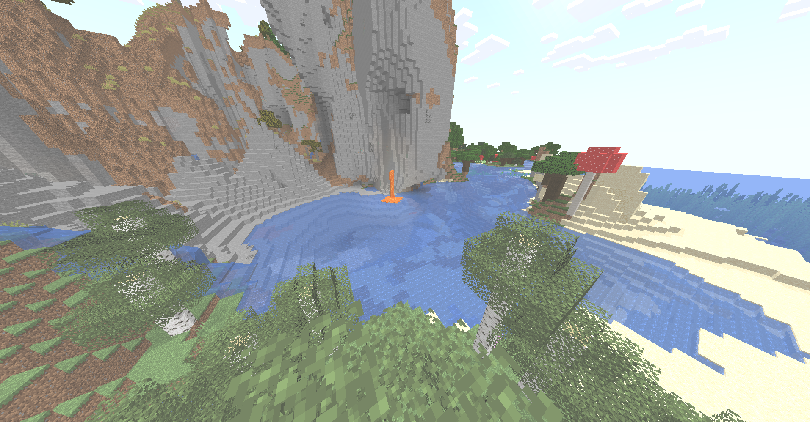
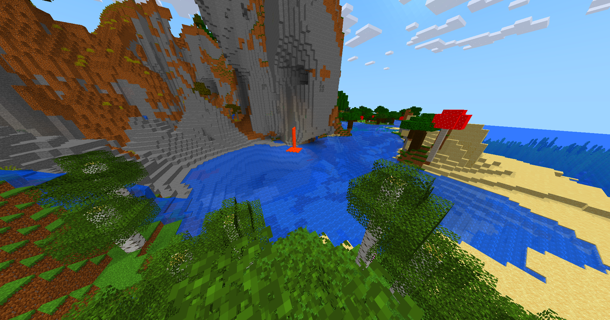
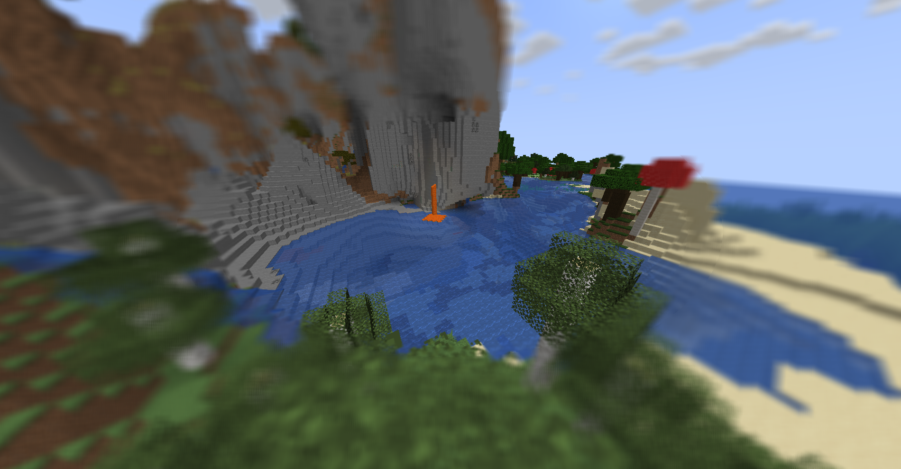

# Lightweight maincraft filter shaders

The shader implements 
- primitive shadows
- filter settings panel
- RGB channel management

## Sepia

## Black and white filter

## Invert

## Grain

## Contrast

## Brightness

## Saturation

## Blur

